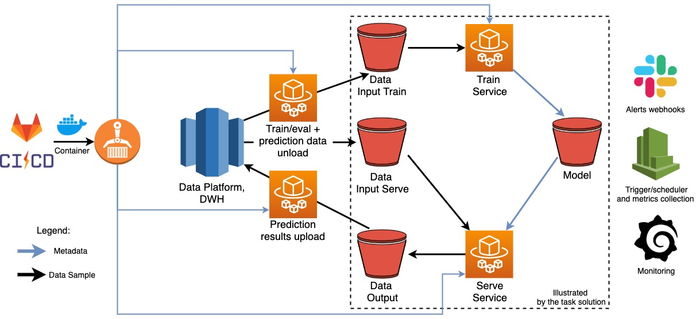

# Conversion Rate Prediction Service


The problem description can be found [here](docs/technical_test_-_instructions.docx). Its main objective is, *to develop a service to predict conversion rate probability* for users searching a given keyword based on the keyword attributes and the device users used for a search.

A data science project flow described in [the article](https://towardsdatascience.com/how-to-power-up-your-product-by-machine-learning-with-python-microservice-pt-1-de0f2b434bec) is being followed. The task is being split into **three stages**:

1. Data discovery:
   - Data cleansing
   - Linear correlations
   - Features engineering
   - Model v1/MVP development
2. Service infrastructure/platform development:
   - Developments of dockerized services to train and serve the baseline model
   - Generalization of the services with aim to be capable to consume any model and run prediction, or to consume any model definition and train it
   - v1 model packaging
   - Service automated unit and smoke/integration tests
3. Iterative model performance improvement:
   - Further feature engineering
   - Higher complexity algorithms
   - Model package extension

---
The main objective of the proposed solution is completed the *stages 1 and 2*:

- to build the predictor service *MVP* model;
- to propose a production ready architecture to hit the main objective of the problem;
- to build production ready *train and serve data pipelines*.

Additional objective is, to improve the model performance of the model.

---

## How to execute the code base

### Requirements

The following programs are required:

```yaml
  docker:
    ver: '>= 19.03'
  
  docker-compose:
    ver: '>= 1.24'
  ```

Port **9999** to be *open* and *not busy*.

**!NOTE!** you should have **sudo** access rights in the env where you plan to run the code.

The code base was executed and tested on the following OS:

```bash
MacOS 10.14.6
Ubuntu 18.04
```

#### Requirements installation

Find details:

- [Ubuntu](https://docs.docker.com/install/linux/docker-ce/ubuntu/)
- [MacOs](https://docs.docker.com/docker-for-mac/install/)
- [Windows](https://docs.docker.com/docker-for-windows/install/)

### First-time run

To launch the code base for the first time, please execute in the root directory of the project:

```bash
chmod +x cold_start.sh && ./cold_start.sh
```

The command run the following set of processes:

- verification of the docker installation
- building of the services docker images
- env2end smoke test for train and serve pipelines
- launch the jupyter-lab with dependencies to read and run `analytics.ipynb` (EDA, modeling experimentation etc.)

### New model deployment/trigger pipeline with existing model

To deploy a new model (e.g. version *v2*), the following steps to be done:

- add the model python module and `install_dependencies.sh` to the package ``./app/package/model_pkg/conversion_rate_model``:

```
model_pkg
├── conversion_rate_model
│    ├── __init__.py
│    ├── model_template.py
│    ├── v1
│    │   ├── __init__.py
│    │   ├── model.py
│    │   └── install_dependencies.sh <- OS dependencies installation script
│    └── v2 <- new model definition
│        ├── __init__.py
│        ├── model.py
│        └── install_dependencies.sh
└── test
     ├── test_model_template.py
     ├── v1
     │   └── test_model_v1.py
     └── v2 <- new model's tests
         └── test_model_v2.py
```

[model.py](app/package/model_pkg/conversion_rate_model/v1/model.py) must include the class **Model** with the methods inherited from the abstract class **Model** defined in [model_template.py](app/package/model_pkg/conversion_rate_model/model_template.py). The OS packages/libraries required by python libraries for a model to be specified as the `pkgs` argument in [install_dependencies.sh](app/package/model_pkg/conversion_rate_model/v1/install_dependencies.sh).

- (optionally, but recommended) add tests for new module
- set the value of env variable **MODEL_VER** in ``./.env_pipelines.sh`` to match the model version name, e.g. *v1* (adjust another env variables values if necessarily)
- trigger the launcher script:

```bash
  chmode +x && ./build_pipeline.sh
```

Call helper to see the options:

```bash
./build_pipeline.sh -h
```

### Repo structure

```
.
├── cold_start.sh       <- code base cold-start/first time launcher
├── cold-start.yaml     <- docker compose config to build servie images from the app dir
├── build_pipelines.sh  <- train and serv pipeline builder and runner, to be used to deploy a new version of the model
├── .env_pipelines.sh   <- build_pipelines.sh env variables/config file
├── analytics           <- jupyter notebook with EDA, feature engineering, experimentation
├── app                 <- services and packages
│   ├── jupyter         <- jupyter Dockerfile+dependecy used on stages 1 and 3
│   ├── package         <- py packages for services
│   │   ├── common_pkg  <- services util
│   │   └── model_pkg   <- models definition package
│   └── service         <- train and serve service runners
│       ├── serve       <- train service runner+dockerfile+dependecies
│       ├── train_mleng <- train service runner+dockerfile+dependecies to train on GCP ML Engine
│       └── train       <- serve service runner+dockerfile+dependecies 
├── bucket              <- data persistence layer (s3/gs buckets "emulation")
│   ├── config          <- "bucket" with parameters config for models hyperparameters tuning
│   ├── data            <- "bucket" with data used for training and prediction
│   └── model           <- "bucket" to persis trained models, e.g. as pickled serialized files
├── smoke_test          <- end2end test
└── docs                <- documentation

```

## Pipelines infrastructure



An illustrates above architecture can be proposed to host the data pipelines required to run (train+serve) the prediction service.

Depending on the data amount the serve service can be deployed and executed

- using AWS ECS+Fargate, or on GCP Cloud Run services. GCP however would require to convert existing service to web-servers.
- using AWS Sagemaker, or on [GCP ML Engine](#model-re-train-on-a-cloud) in case higher scalability at low effort would be required.

The pipeline part shown inside the dashed rectangle is being built and considered within the scope of this task exclusively. It is being mimicked using local disk storage instead of s3 buckets and local docker runner machine instead of ECS+Fargate/GCP Cloud Run services.

### Modus operandi

#### Train Service

1. Read train and eval data sets from the source, e.g. s3, or gs bucket (mimicked by reading data from disk)
2. Perform data preparation to comply with the model input data structure SLA *)
3. Train the model
4. Save the model metadata into destination, e.g. s3, or gs bucket

*) It is advised to perform all data preparation on the level of data platform/DWH (e.g. in redshift, or snowflake, or bigquery) steps prior to training stage. **!Note!** the services for in-database data preparation and for unloading data from database to the bucket are beyond the scope of this task. The train/eval/predict data sets are being prepared and stored in `bucket/data` (see details in [the notebook](#modelingexperimentation)).

#### Serve Service

1. Read train and eval data sets from the source, e.g. s3, or gs bucket (mimicked by reading data from disk)
2. Perform data preparation to comply with the model input data structure SLA
3. Run prediction
4. Save the prediction results as compressed flat data file (csv) with the following structure (output SLA):

```
entity_id,device,cr
20458,0,0.03653155867612641
20458,1,0.026293864889505317
```

Both services push an alert/info message as a webhook to slack (requires WEBHOOK_URL env parameter to be set).

## Modeling/Experimentation

Please see details of experimentation in the jupyter notebook ``./analytics/analytics.ipynb``. It should be accessible on http://localhost:9999/lab/tree/analytics/analytics.ipynb if you successfully completed [the first-time run step](#first-time-run).

### Model re-train on a cloud - ToDo

GCP ML Engine is being used for faster model experimentation and retraining:

1. Build a generic service
2. Add model to the model_pkg
3. Build a train service image
4. Push the image container to the google container registry (gcr)
5. Push a set of hyper-parameters to google cloud storage bucket (gs)
6. Trigger a training job

Infra:

```yaml
- GS:
  - 
```


## Followup/further ToDo's

### Infrastructure

- Models version control with e.g. [DVC](https://dvc.org/)
- Add ci/cd
- Add metrics push to cloudwatch, or prometheus integration
- Orchestrator for pipelines, e.g. with apache airflow
- Deploy the serve service as web-serve to make real-time conversion rate prediction

### Model

- Enlarge data sample
- Employ advanced classes ("CR > 0" and "CR = 0") balancing techniques
- Add more time-series periods to capture keywords conversion rate probability seasonality
